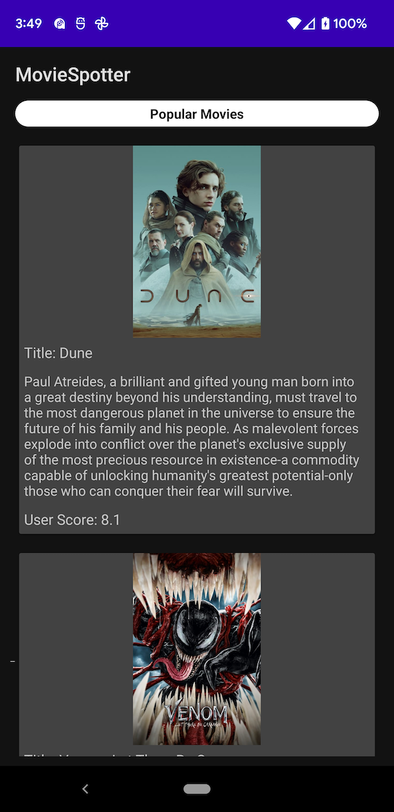

# moviespotter

MovieSpotter is an Android app that displays the current most popular movies!

[Video Walkthrough and Demo on YouTube](https://www.youtube.com/watch?v=I44hxRAaM9Y)

## APK Download
[Download the APK Here](https://drive.google.com/drive/folders/1IRCjpgzMtE7eoJJ8_1QTZMqDV7G8eqqm?usp=sharing) and simply install on an Android device.
If you're having trouble downloading you may have Blocked Third-Party Cookies: [Click here for steps on allowing permissions](https://support.google.com/drive/answer/2423534?hl=en&co=GENIE.Platform%3DDesktop#zippy=%2Cblocked-third-party-cookies-can-prevent-drive-web-downloads)

## Technologies
* Kotlin
* Java
* REST API from [The Movie Database](https://developers.themoviedb.org/3/)
* Retrofit2
* OkHttp3
* AndroidX JUnit
* Espresso
* Jetpack Compose Libraries
* Full list of dependencies is in the build.gradle file

## Requirements:
* Write the app primarily in Kotlin, but at least one file must be written in Java.
* Retrieve data from a REST or GraphQL API and display it in the app.
* Use modern networking libraries, including Retrofit and OkHttp3
* Handle loading and error states
* Use both Jetpack Compose UI and legacy .xml layout files, in any proportion.
* Utilize Jetpack libraries when applicable
* Write a unit test using AndroidX JUnit
* Write an automated UI test using Espresso
