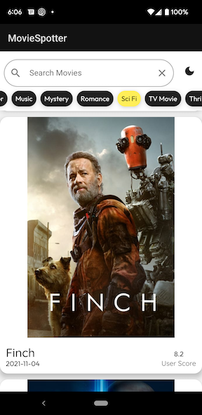

# moviespotter

MovieSpotter is an Android app to search for details about your favorite movies! 
See popular movies, select by genre, or search for your favorites!
Save movies you want to watch later or mark them as watched!

## Technologies
* Kotlin
* Java
* REST API from [The Movie Database](https://developers.themoviedb.org/3/)
* Firebase
* Retrofit2
* OkHttp3
* Glide
* Jetpack Compose
* Hilt 
* AndroidX JUnit
* Espresso
* Full list of dependencies is in the build.gradle file
